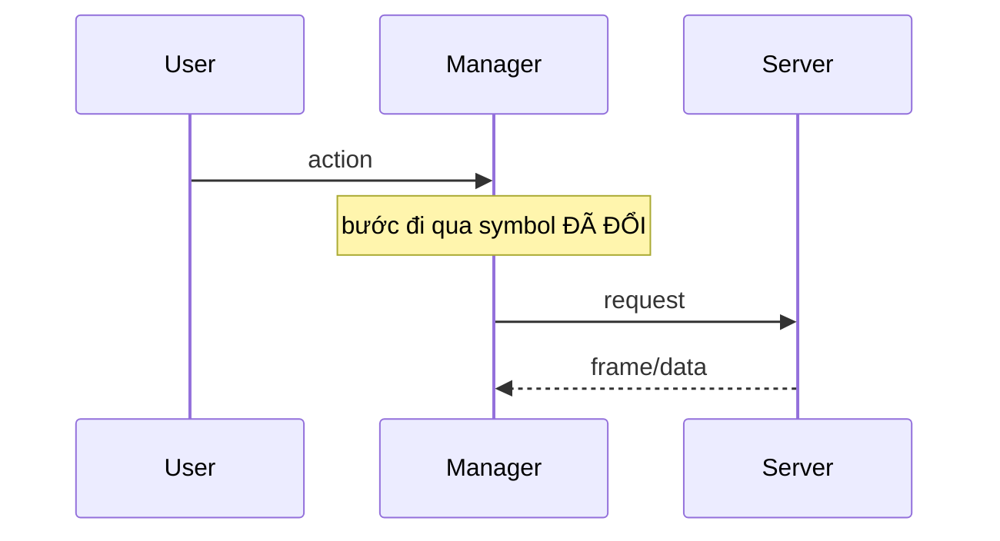

# PR Review with GitNexus — 3 tầng + kỹ thuật pr-agent & pr-swarm

Review một PR / nhánh / diff **như một senior thật**: đi từ trên xuống qua **3 tầng**, **validate cả
chính thiết kế** (không coi doc là chân lý), áp các kỹ thuật của [pr-agent](https://docs.pr-agent.ai) và
[pr-swarm-review](https://github.com/hinh1108/GitNexus/tree/main/pr-swarm-review). Kết luận review phải ra
**verdict merge-readiness** rõ ràng. **Báo cáo bằng tiếng Việt.**

> **READ-ONLY tuyệt đối.** Review KHÔNG sửa file, KHÔNG commit/add/checkout, KHÔNG `gh pr comment/review`,
> KHÔNG cài package/chạy script tuỳ tiện. Chỉ dùng lệnh đọc: `git log/diff/show/grep/ls-files`,
> `gh pr view/diff/checks`, `grep/cat/find/ls`, và các tool GitNexus (đều read-only).
> Ngoại lệ duy nhất: user chọn "xuất `.md`" (ghi 1 file báo cáo) hoặc "comment PR" ở Bước 1-Q4.

| Tầng | Câu hỏi cốt lõi | Persona lens | Công cụ chính |
|---|---|---|---|
| **1. Kiến trúc tổng thể** | Ăn khớp kiến trúc & data-flow tổng thể? Sinh module/tầng/luồng lệch? **Doc kiến trúc còn khớp code không?** | Architect / System | docs kiến trúc + `clusters` + `processes` + `impact` |
| **2. Thiết kế module / luồng** | Component tổ chức đúng pattern hiện có? Data flow đi chuẩn? (DB nếu có) | Frontend (component org) · Backend (data flow) | `context` + `process/{name}` + đọc pattern anh em |
| **3. Low-level** | Hàm tổ chức ổn? **Trùng lặp/thừa** với code đã có? Correctness / leak / perf. | Senior dev / domain | `query` + `context` + `cypher` + đọc diff |

> **Tầng trên sai thì tầng dưới đúng cũng vô nghĩa** — hàm hoàn hảo đặt sai tầng kiến trúc vẫn là nợ.
> Review từ tầng 1 xuống; đừng nhảy thẳng vào correctness.

## Kỹ thuật mượn (áp xuyên suốt)

Nguồn: **pr-agent** *(pa)* · **pr-swarm-review** *(ps)* — link ở đoạn mở đầu. Bảng xếp theo đúng thứ tự áp dụng trong workflow (Bước 0 → 1.5 → 2 → 3).

| Kỹ thuật | Nguồn | Áp vào skill này |
|---|---|---|
| **Chuẩn từ base branch** | pa | Đọc quy ước & thiết kế "chuẩn" từ **`main`** + `CLAUDE.md`/`AGENTS.md` + docs kiến trúc — KHÔNG lấy từ nhánh PR (PR không tự định chuẩn của chính nó); finding lệch → nhãn **[lệch quy ước]**. |
| **Branch hygiene / churn** | ps | Bước 0 phân loại; commit merge-from-main / version bump / refactor lạc đề → nghi ngờ, đề xuất **rebase/split**. |
| **Read-only enforcement** | ps | Whitelist lệnh đọc, cấm mọi lệnh ghi (đã nêu đầu skill); áp cho **MỌI subagent** ở Swarm — nhắc lại trong prompt giao việc. |
| **Describe** | pa | Bước 1.5 (tùy chọn): phân loại **PR type** + bảng walkthrough (tách docs khỏi code) + **mermaid data-flow** dựng từ `processes`. |
| **Review effort + tách PR** | pa | Ghi **effort 1–5**; commit gộp docs+feature+refactor → **đề xuất tách**. |
| **Swarm mode + model tier** | ps | Bước 2: **Solo (mặc định)** hoặc **Swarm** khi diff lớn/nhiều tầng — fan-out mỗi tầng/lens thành 1 subagent song song; lane checklist tier **nhẹ**, lane phân tích tier **nặng**; synthesis-critic gate cuối. |
| **Dynamic context (bất đối xứng)** | pa | Soi 1 hunk phải đọc cả **hàm/class bao ngoài** (`context include_content:true`); soi state **TRƯỚC** đổi kỹ hơn — đừng review 3 dòng diff trơ trọi. |
| **Ưu tiên & không cắt im lặng** | pa | Ưu tiên **code > docs**, code mới > code xoá; diff lớn → **ghi RÕ phần chưa soi kỹ**, không cắt im lặng. |
| **Self-reflection** | pa | Bước 3: tự chấm lại `confidence×severity` + 1 dòng lý do, **bỏ nhiễu**, xếp hạng — chống false-positive (nhất là khi `impact` under-report). |
| **Uncertainty → verify** | ps | Chỗ chưa chứng minh (impact under-report / chưa soi kỹ / nghi ngờ) → **KHÔNG kết luận**, đẩy sang "Cần verify" kèm lệnh kiểm cụ thể. |
| **Verdict cứng** | ps + pa | Bước 3: kết luận **3 verdict** (Merge State · Branch Hygiene · Final), mỗi cái đúng 1 nhãn; mỗi finding gắn **Blocks merge: yes/no/maybe**; đối chiếu ticket → **verdict tuân thủ** (Fully/Partially/Not/Code-Verified). |

## Quy tắc GitNexus cho repo này (đọc trước)

- **Xác định `<repo>` trước:** `list_repos({})` → nếu registry chỉ có 1 index thì `repo` là tùy chọn;
  nếu có nhiều index cùng gốc thì **truyền `repo` cho MỌI tool** (không có → lỗi `Multiple repositories indexed`).
- **Truyền `repo` cho MỌI tool khi cần định danh.** Alias có thể đã mất → khi lỗi `Multiple repositories indexed` /
  `Repository "<repo>" not found`, dùng **path đầy đủ** tới gốc repo (lấy từ `list_repos`).
  (Khôi phục alias: `node .gitnexus/run.cjs analyze --name <repo>`.)
- **`impact(direction:"upstream")` có thể BÁO THIẾU** (chỉ đi cạnh Function/Method). `upstream=0` KHÔNG =
  an toàn — đối chiếu `context({name})` (`incoming.calls`) hoặc `grep` trước khi kết luận LOW.
- **FTS/embeddings có thể không nạp được** → nếu vậy `query` full-text kém chính xác; ưu tiên `context`/`impact`/`grep`/`cypher`.

## Bước 0 — Tự kiểm tiền đề (KHÔNG hỏi user)

```
1. node .gitnexus/run.cjs status        → index khớp HEAD? (stale → cảnh báo/analyze)
2. list_repos({})                        → lấy đúng path index; có PDG chưa
3. explain({limit:1}) thử               → "no taint layer" = KHÔNG có PDG
4. git rev-parse --abbrev-ref HEAD       → nhánh hiện tại (đối tượng mặc định)
5. git rev-list --left-right --count main...HEAD  → ahead/behind (phạm vi lớn cỡ nào)
6. gh pr view <branch> / git log         → PR/ticket gắn nhánh? lấy mô tả → ticket-compliance
7. gh pr view --json state,mergeable,mergeStateStatus,isDraft + gh pr checks  → Merge State + CI
   (không có PR/gh → suy Merge State từ git: conflict với main? → ghi "visibility incomplete")
8. git log main..HEAD --oneline           → Branch Hygiene: có commit merge-from-main / churn lạc đề?
9. Có DB không? (grep migrations/schema/*.sql/ORM) → không → SKIP tầng DB như SKIP taint
```

- Index **stale** → báo user, đề nghị `analyze --name <repo>` trước.
- **Không PDG** → bỏ security-taint khỏi câu hỏi, ghi rõ đã skip. **Không DB** → skip tầng DB, ghi rõ.
- **Diff gộp nhiều theme / churn lạc đề / merge-from-main** → cờ decomposition + hygiene: tách docs khỏi code khi đo, đề xuất rebase/split.
- **Không thấy được state PR/CI** (không có gh/không phải PR) → Merge State = "visibility incomplete", đẩy sang "Cần verify", KHÔNG đoán mergeable.
- Suy ra được base (`main`) + đối tượng → **đừng hỏi lại**; chỉ hỏi khi mơ hồ.

## Bước 1 — Hỏi user (AskUserQuestion, gộp 1 lần, ≤4 câu)

**Q1. Đối tượng** *(chỉ hỏi nếu không chắc / phạm vi quá lớn)* — Nhánh vs `main` *(Rec)* · Commit/range · PR số · Diff local.

**Q2. Tầng & lens** *(multiSelect)* —
Kiến trúc tổng thể *(Rec)* · Tổ chức component/thiết kế module · **Trùng lặp/thừa** *(Rec)* ·
Correctness *(Rec)* · Regression *(Rec)* · Coupling · Performance · Security-taint *(chỉ nếu có PDG)*.

**Q3. Validate CHÍNH thiết kế?** — Có: đối chiếu doc↔code + phản biện thiết kế *(Rec nếu chạm kiến trúc/backend)* · Không: chỉ dùng thiết kế làm chuẩn.

**Q4. Độ sâu + Đầu ra** — Sâu: Vừa *(Rec)*/Nhanh/Sâu · Ra: Báo cáo 3 tầng + blast radius *(Rec)*/Tóm tắt/Chi tiết+trace/Xuất `.md` hoặc comment PR.

> Base mặc định `main`; ngưỡng cảnh báo **HIGH**. Đọc quy ước/thiết kế "chuẩn" từ **`main`**, không từ nhánh PR.

## Bước 1.5 — Describe + sơ đồ (BẮT BUỘC nếu diff > ~20 file hoặc mixed; nếu nhỏ thì rút gọn)

Trước khi soi, dựng "bức tranh PR" kiểu pr-agent `/describe`. **Người review đọc SƠ ĐỒ trước, đọc chữ sau** —
đừng bắt họ dò `file:line` để hình dung. Bắt buộc phải có ≥1 sơ đồ kiến trúc + ≥1 sơ đồ luồng.

- **PR type**: feat / fix / refactor / docs / mixed (mixed → cờ decomposition).
- **Walkthrough**: bảng `file/cụm → tóm tắt thay đổi` (tách docs khỏi code).
- **Sơ đồ 1 — Kiến trúc & vùng đụng** (`flowchart`): các tầng/module từ `clusters` + hướng phụ thuộc;
  **tô đậm/đánh dấu** node/cạnh mà diff chạm vào để mắt thấy ngay "đổi ở đâu trong bức tranh".
- **Sơ đồ 2 — Luồng chính bị đụng** (`sequenceDiagram`): dựng từ `gitnexus://repo/<repo>/process/{tên}`
  của flow bị đụng; đánh dấu bước đi qua symbol đã đổi → neo trực quan cho tầng 2.

Template (thay tên thật; giữ cú pháp để render được):
````
```mermaid
flowchart TD
  subgraph UI["Tầng UI (mode)"]; A[Component]; end
  subgraph EXT["Extension / Adapter"]; B[Manager]; C[Bridge]; end
  subgraph CORE["Core (KHÔNG đụng)"]; D[(Service)]; end
  A --> B --> C
  B -.command.-> D
  classDef touched fill:#fde,stroke:#c39,stroke-width:2px;
  class B,C touched     %% node bị diff chạm — đánh dấu để thấy ngay
```

````

## Bước 2 — Chạy review theo 3 tầng

### Chế độ chạy: Solo (mặc định) vs Swarm (song song)

- **Solo** *(mặc định, diff nhỏ/vừa)*: một mình chạy tuần tự 2A → 2B → 2C. Đơn giản, ít token.
- **Swarm** *(diff lớn / nhiều tầng / user chọn "Sâu")*: fan-out **subagent song song** rồi tổng hợp.
  Thứ tự phụ thuộc như pr-swarm: **facts trước → phân tích song song → synthesis-critic gate cuối**.

```
Swarm — sơ đồ giao việc (dùng Agent tool, chạy song song ở tầng giữa):
  Lane A (facts+hygiene, tier nhẹ)  : Bước 0 đã có → gom PR facts + branch hygiene + merge state
        ↓ (xong A mới đủ ngữ cảnh cho các lane sau)
  ── song song ──
  Lane 1 (kiến trúc, tier nặng)     : 2A — clusters/processes + validate thiết kế
  Lane 2 (module/data-flow, nặng)   : 2B — detect_changes + process/{name} + pattern anh em
  Lane 3 (low-level+trùng lặp, nặng): 2C — query/context/cypher + correctness/leak/perf + impact
  Lane 4 (test/CI, tier nhẹ)        : coverage cho symbol đổi + gh pr checks + regression flow
  Lane 5 (security, nặng, nếu chọn) : explain (PDG) + trust boundary/secrets/injection
  ── gate ──
  Lane 7 (synthesis-critic, nặng)   : GOM mọi finding → dedup → xử mâu thuẫn giữa lane →
                                       self-reflection (bỏ nhiễu) → ra 3 verdict. GATE BẮT BUỘC.
```

- Giao mỗi lane bằng Agent tool, prompt nhắc lại: **READ-ONLY**, truyền `repo`, trả finding theo format
  chuẩn (Risk/Evidence/Fix/Blocks-merge). Lane checklist (A, 4) → subagent tier nhẹ; lane phân tích → tier nặng.
- **Lane 7 không được bỏ**: chưa qua synthesis-critic thì CHƯA xuất báo cáo. Nó là nơi dedup + chốt verdict.
- Solo mode vẫn làm đúng các việc của từng lane, chỉ khác là tuần tự trong 1 context.

### 2A · Tầng 1 — Kiến trúc tổng thể + validate thiết kế
```
1. Nạp "chuẩn kiến trúc" (từ base branch `main`, không từ nhánh PR):
   - Đọc doc kiến trúc của dự án (vd: docs/*, ADR/*, CLAUDE.md/AGENTS.md) — tự dò thư mục docs thực tế.
   - READ gitnexus://repo/<repo>/clusters   → functional area (tầng/module thực tế)
   - READ gitnexus://repo/<repo>/processes  → execution flow tổng thể (data flow thực tế)
2. VALIDATE chính thiết kế (nếu Q3=Có) — ĐỪNG coi doc là chân lý:
   - So doc ↔ clusters/processes: doc còn khớp code? tầng nào doc nói có mà code không (hoặc ngược lại)?
     → nêu comment VỀ CHÍNH thiết kế. Cần chiều sâu → giao subagent `architecture-designer` kèm
       output clusters/processes + doc để phản biện dựa trên pattern chuẩn ngành.
3. ĐỐI CHIẾU diff với kiến trúc:
   - Symbol/file đổi rơi vào cluster nào? File/module MỚI không thuộc cluster nào → nghi lệch tầng.
   - Import/gọi VƯỢT TẦNG không (vd: UI gọi thẳng transport, tầng cao thò vào nội bộ tầng thấp)? grep import.
   - Sinh "module/luồng song song" trùng chức năng tầng đã có không (→ 2C).
   → Verdict tầng 1: ĂN KHỚP / LỆCH (+ điểm lệch cụ thể).
```

### 2B · Tầng 2 — Thiết kế module / component / data flow
```
1. detect_changes({scope:"compare", base_ref, repo}) → symbol đổi + flow bị đụng (TÁCH docs khỏi code).
   Output lớn → giao subagent đọc file kết quả, giữ context chính gọn.
2. Component (lens Frontend): thành phần MỚI theo pattern anh em không (props/handler/command wiring,
   tách file, đặt tên)? Đọc 1–2 thành phần cùng loại đã có để so. Contract giữa các tầng (vd: caller
   dùng API/command nào thì phía cung cấp phải đăng ký/expose) — grep xác nhận TỪNG cái.
3. Data flow (lens Backend): READ gitnexus://repo/<repo>/process/{tên} cho flow bị đụng → bước nào đi
   qua symbol đã đổi; luồng đúng thứ tự/tầng? state reset đúng ở ranh giới (khởi tạo lại, teardown,
   đổi ngữ cảnh/phiên)? Đọc cả hàm/class bao ngoài hunk (dynamic context), soi state TRƯỚC đổi.
4. Database (nếu có): schema/migration/index/transaction vs data flow. KHÔNG có → skip, ghi rõ.
```

### 2C · Tầng 3 — Low-level: correctness + TRÙNG LẶP + leak/perf
```
1. TRÙNG LẶP / THỪA (làm TRƯỚC khi khen "hàm mới hợp lý"):
   - Mỗi hàm/util MỚI: query({search_query:"<chức năng>"}) + context({name:"<tên gần giống>"})
     + grep signature → đã có hàm làm việc này chưa? Có → đề xuất tái dùng, không viết mới.
   - cypher tìm hàm cùng shape nếu cần.
2. Correctness: null/undefined deref, nhánh sai, off-by-one, race, missed await, state không reset.
3. Leak/perf: listener/timer/disposer dọn trong dispose()/teardown? throttle/debounce đúng? round-trip
   thừa? đường nóng (hot path) chậm thêm?
4. Symbol trọng tâm: impact({target, direction:"upstream", repo}) → blast radius. upstream=0 phải đối chiếu.
5. Security taint (nếu chọn & có PDG): explain({target, repo}) → source→sink.
```

## Bước 3 — Synthesis-critic gate → chấm risk → verdict → báo cáo

**Synthesis-critic gate (bắt buộc, trước khi viết — ở Swarm là Lane 7):**
1. **Gom + dedup**: gộp finding từ mọi tầng/lane; trùng file:line/cùng nguyên nhân → gộp 1.
2. **Xử mâu thuẫn giữa lane**: 2 lane kết luận trái nhau → ưu tiên cái có evidence code cụ thể; nếu chưa
   ngã ngũ → đẩy sang "Cần verify", KHÔNG chọn bừa.
3. **Self-reflection**: tự chấm lại từng finding theo `confidence (0–10) × severity` + 1 dòng lý do;
   **bỏ finding điểm thấp/không đứng vững** (đặc biệt cái chỉ dựa `upstream`/suy đoán chưa đối chiếu code);
   xếp hạng cao→thấp. Mục tiêu: báo cáo ít mà chắc, không nhiễu.
4. **Uncertainty → verification task**: chỗ chưa chứng minh được KHÔNG kết luận — chuyển thành 1 task trong
   "Cần verify" kèm lệnh/cách kiểm cụ thể (grep gì, chạy test nào, đọc file nào).

Thang risk:

| Ảnh hưởng | Risk |
|---|---|
| <5 symbol, ít flow | LOW |
| 5–15 symbol, 2–5 flow | MEDIUM |
| >15 symbol hoặc nhiều flow | HIGH |
| Đường tới hạn (hot path, session, auth, thanh toán…) **hoặc lệch kiến trúc tầng 1** | CRITICAL |

**3 verdict cứng (mỗi cái đúng 1 nhãn — mượn pr-swarm):**

| Verdict | Các nhãn hợp lệ |
|---|---|
| **Merge State** | mergeable · blocked by conflicts · checks pending · checks failing · review blocked · draft/WIP · merged · closed without merge · visibility incomplete |
| **Branch Hygiene** | clean feature/fix · merge-from-main harmless & merge-safe · polluted by unrelated merge/churn · rebase/split required |
| **Final Verdict** | production-ready · production-ready with minor follow-ups · not production-ready · rebase/split required before final review |

- Risk tổng detect_changes tính cả docs → **tách docs, chấm lại theo code thực**.
- **Cảnh báo rõ nếu HIGH/CRITICAL hoặc LỆCH KIẾN TRÚC** trước khi kết luận "ổn để merge".
- 1 finding chặn merge (CRITICAL / lệch kiến trúc / security) → **Final Verdict không thể là production-ready**.
### Trình bày finding — QUÉT NHANH trước, chi tiết sau (chống "tường chữ")

Người review phải hiểu bức tranh **không cần dò `file:line`**. Vì vậy findings xuất theo **2 lớp**:

1. **Bảng tổng quan** (mọi finding, kể cả LOW) — 1 dòng/finding để quét trong 10 giây.
2. **Card chi tiết** chỉ cho **MED trở lên** — cấu trúc CỐ ĐỊNH 3 dòng, KHÔNG viết prose tự do.
   Điểm self-reflection để ở **cột bảng**, không nhét trong đoạn văn.

Mẫu card cố định (mỗi finding đúng khuôn này — dễ so sánh, không lan man):
```
**F1 — <tiêu đề 1 dòng>**  ·  [MED][Blocks: maybe]  ·  `file.ts:223`  ·  `[lệch quy ước]`(nếu có)
- **Hiện tượng:** <cái gì sai/thiếu, quan sát được>
- **Vì sao:** <cơ chế — 1 câu, dẫn symbol/flow bị đụng>
- **Fix:** <việc cần làm — cụ thể, làm được ngay>
```

### Khung báo cáo (tiếng Việt) — thứ tự = dễ đọc dần vào chi tiết
```
## Review: <đối tượng> vs <base>
> Read-only · Base = `<base>` · Chế độ: Solo/Swarm · Ngày: <YYYY-MM-DD>

**Verdict:**  Final: <…> · Merge State: <…> · Branch Hygiene: <…>
**Ticket-compliance:** Fully / Partially / Not / Code-Verified — <lý do> (bỏ nếu không có ticket)
**Tóm tắt:** <2–3 câu: ăn khớp kiến trúc? blocker? rủi ro chính?> · PR type: <…> · Review effort: <1–5>

### Sơ đồ (BẮT BUỘC — đọc trước khi đọc chữ)
**Kiến trúc & vùng đụng:**  ```mermaid flowchart … (đánh dấu node bị đụng) ```
**Luồng chính bị đụng:**    ```mermaid sequenceDiagram … ```

### Phạm vi đã đo
| Chỉ số | Giá trị |   (commit · file · code vs docs · file core bị đụng · PDG? · DB?)

### Findings — bảng quét nhanh
| ID | Tầng | Risk | Blocks | Vị trí | Vấn đề (1 dòng) | Chấm |
|----|------|------|--------|--------|-----------------|------|
| F1 | 2 | MED | maybe | `file.ts:223` | <tóm tắt> | 8×MED |
(sắp cao→thấp; LOW cũng nằm đây, chỉ 1 dòng, KHÔNG cần card riêng)

### Tầng 1 — Kiến trúc tổng thể
- Verdict: ĂN KHỚP / LỆCH — <module mới sai tầng / import vượt tầng / luồng song song…>
- Nhận xét VỀ CHÍNH thiết kế (nếu validate): <doc ↔ code khớp không, đề xuất chỉnh thiết kế>

### Tầng 2 — Thiết kế module / component / data flow
| Vùng | Symbol/flow bị đụng | Nhận xét (pattern/luồng) | Risk |

### Tầng 3 — Chi tiết (chỉ MED+; mỗi finding theo card cố định ở trên)
- Trùng lặp/thừa: <hàm mới đã có ở …, nên tái dùng> (hoặc: không phát hiện)
- <các card F… theo khuôn Hiện tượng / Vì sao / Fix>

### Cần verify (chỗ chưa chứng minh — KHÔNG đoán)
- <nghi ngờ> → kiểm bằng: <grep/test/đọc file cụ thể>

### Regression cần test
- <execution flow> — vì <lý do>

### Đề xuất tách PR / rebase (nếu gộp nhiều theme / churn)   ### Cảnh báo
- <theme A · theme B · merge-from-main…>                     - <HIGH/CRITICAL · lệch kiến trúc · stale · PDG/DB thiếu → đã skip · upstream báo thiếu · merge-state/CI chưa thấy được>
```

## Checklist
```
- [ ] READ-ONLY suốt phiên (không sửa/commit/comment trừ khi user chọn xuất .md/comment PR)
- [ ] Bước 0: status(stale?) · list_repos đúng path · PDG? · DB? · PR/ticket? · merge-state+CI(gh pr checks) · branch hygiene · phạm vi
- [ ] hỏi user (≤4 câu, bỏ câu tự biết) — validate thiết kế không (Q3)
- [ ] Describe: PR type + walkthrough + **2 sơ đồ mermaid BẮT BUỘC** (kiến trúc-vùng-đụng + luồng chính) khi PR lớn/mixed
- [ ] chọn chế độ: Solo (mặc định) / Swarm (diff lớn → fan-out subagent + Lane 7 gate; nhắc READ-ONLY từng subagent)
- [ ] TẦNG 1: doc(main) + clusters + processes → đối chiếu diff → verdict ĂN KHỚP/LỆCH; validate thiết kế nếu Q3
- [ ] TẦNG 2: detect_changes(tách docs) · component theo pattern? · process cho flow bị đụng · dynamic context
- [ ] TẦNG 3: TRÙNG LẶP (query/context/grep TRƯỚC) · correctness/leak/perf · impact upstream (đối chiếu, đừng tin =0)
- [ ] security taint nếu chọn & có PDG
- [ ] SYNTHESIS-GATE: dedup · xử mâu thuẫn lane · self-reflection(bỏ nhiễu) · uncertainty→"Cần verify"
- [ ] risk theo CODE (bỏ docs) · 3 VERDICT (Merge State/Branch Hygiene/Final) · ticket-compliance · finding gắn Blocks-merge · cảnh báo HIGH/CRITICAL/lệch-kiến-trúc · gợi ý tách PR/rebase
- [ ] xuất báo cáo tiếng Việt: **2 sơ đồ trước** → **bảng findings quét-nhanh** → card MED+ (Hiện tượng/Vì sao/Fix), điểm ở cột bảng — KHÔNG prose dày
```
